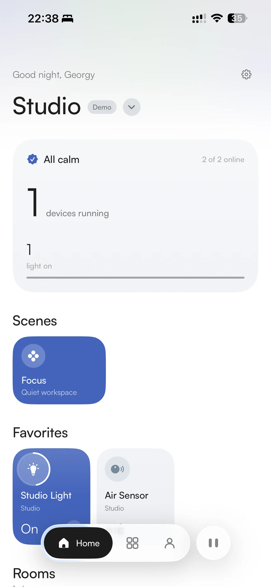
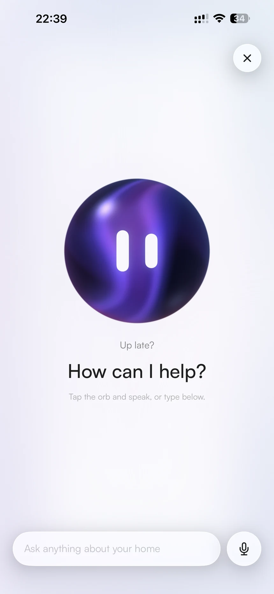
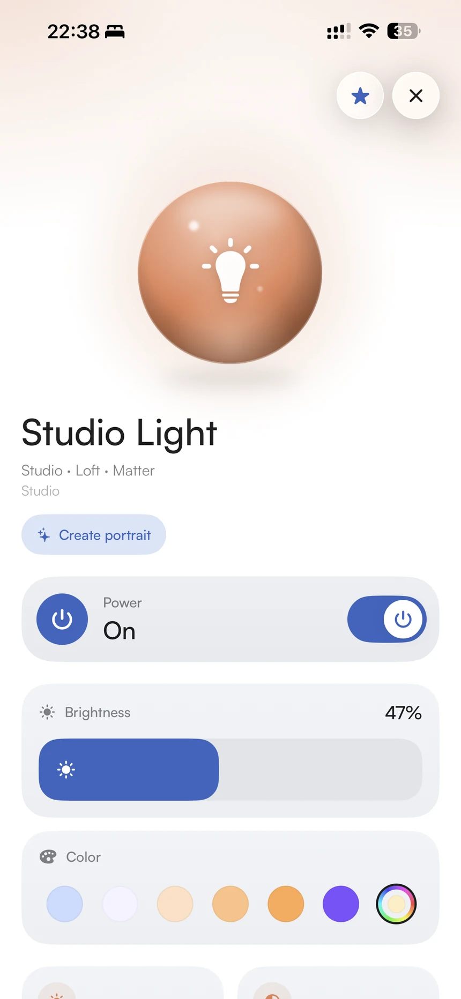
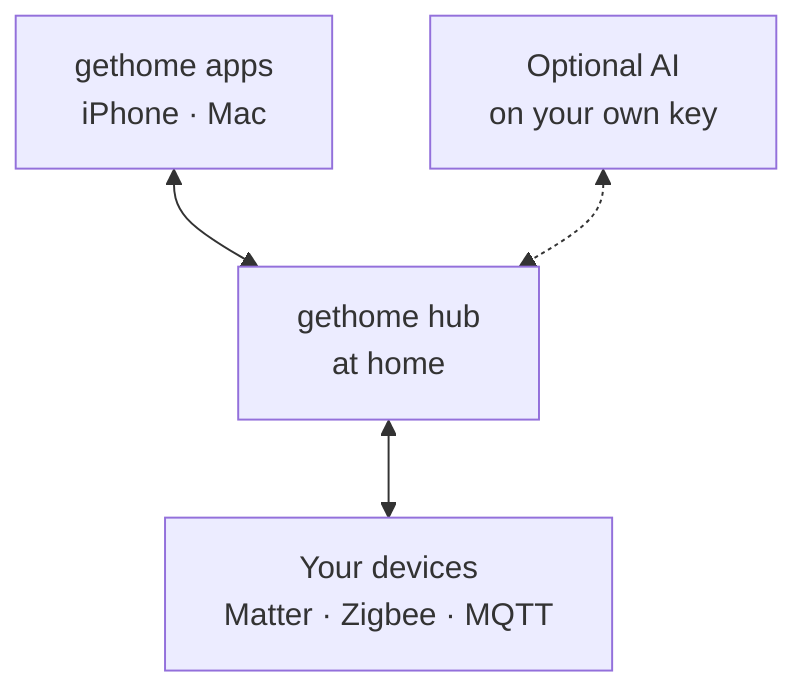

<p align="center">
  
</p>

<h1 align="center">gethome hub</h1>

<p align="center">
  <strong>The local brain of your home.</strong>
</p>

<p align="center">
  Matter, Zigbee and MQTT devices in one app. An assistant you can talk to, and rules you write by describing them. It runs on a small computer at home, on your own Wi-Fi — with your own AI key and no cloud account.
</p>

<p align="center">
  <a href="https://github.com/gethome-inc/gethome-hub/actions/workflows/ci.yml"></a>
  <a href="LICENSE.md"></a>
  
  
</p>

<p align="center">
  <a href="#get-started">Get started</a> ·
  <a href="#what-it-does">What it does</a> ·
  <a href="docs/hardware.md">Hardware</a> ·
  <a href="#documentation">Docs</a> ·
  <a href="https://gethome.me">gethome.me</a>
</p>

<p align="center">
  <picture>
    <source media="(prefers-color-scheme: dark)" srcset="docs/assets/screens/home-dark.webp">
    
  </picture>
  <picture>
    <source media="(prefers-color-scheme: dark)" srcset="docs/assets/screens/assistant-dark.webp">
    
  </picture>
  <picture>
    <source media="(prefers-color-scheme: dark)" srcset="docs/assets/screens/device-dark.webp">
    
  </picture>
</p>

<p align="center">
  <sub>gethome for iPhone — not on the App Store yet. <a href="https://gethome.me/#waitlist">Join the waitlist</a>.</sub>
</p>

## What is a hub?

Most smart-home gear belongs to an account: pair a lamp with one phone and it answers to that phone, and to nobody else. A hub turns that around. It is **one small box on your shelf that owns your devices**, so everyone you invite — each with a role of their own — sees the same home, and your rules keep running while every phone is out of the house. One hub is one home.

There is no account to create. Nothing about your home leaves your network unless you give the hub an AI key — and then only what the AI feature you use needs ([what goes where](https://gethome.me/privacy#ai)).

In one line: your devices talk to the hub, and your phone talks to the hub over your own Wi-Fi.



## What it does

- **Every device, one app.** Matter devices, Zigbee devices (through [Zigbee2MQTT](https://www.zigbee2mqtt.io) and a USB stick) and your own MQTT hardware all speak one typed schema — 27 capabilities across 16 kinds of device — so each gets controls that fit it. → [Zigbee](docs/zigbee.md) · [Matter](docs/matter.md) · [the schema](docs/device-schema.md)
- **Ask the house.** An assistant answers questions about your home, works your devices and presses your scenes — typed, or spoken. It runs on your own Anthropic or OpenAI key; the spoken version needs an OpenAI key. → [The assistant](docs/assistant.md)
- **Rules in plain words.** Describe what you want and an agent writes the rule, shows it back to you as a flow and saves it *switched off* until you turn it on. Scenes are rules you can press. Rules keep running with no AI key at all. → [Automations](docs/automations.md)
- **Devices it has never seen.** Pair a Zigbee device the hub doesn't know and an agent works out what it is, so it gets real controls instead of a blank tile. It needs your AI key; without one the device still appears, flagged *needs review*. → [AI device recognition](docs/ai-adaptation.md)
- **A home for everyone in it.** Invite family with a short-lived code. Owner, Member and Guest come built in, you can add roles of your own, and the same person can sign in on a second device as themselves. → [Roles and sharing](docs/api.md#roles-and-permissions-in-full)
- **What happened, and when.** Temperature, humidity, air quality and power are kept in five-minute steps for a week, and an activity feed shows what was asked of the home, and by whom. → [History](docs/api.md#recorded-readings-get-devicesidhistory)
- **Build your own.** Anything that can publish JSON over MQTT can be a device, with no hub-side code, and the hub's local REST and WebSocket API is documented. → [The MQTT convention](docs/mqtt-integrations.md) · [The API](docs/api.md)
- **Private by default.** No cloud account, and your AI key stays on the hub. → [Private by design](#private-by-design)

Also: AI portraits of your devices, drawn on the hub with your OpenAI key and shared by everyone in the home ([portraits](docs/portraits.md)).

## The gethome family

- **gethome hub** *(this repository)* — the brain: talks to your devices, runs your rules and agents, and serves your apps. **Public, and installs today with one command** — see [Get started](#get-started).
- **gethome for iPhone** — the everyday app: rooms and devices, the assistant, rules, history and widgets. **Not on the App Store yet** — [join the waitlist](https://gethome.me/#waitlist).
- **gethome studio for Mac** — guided setup: writes the SD card or finds a Pi on your network, installs and claims the hub, and keeps it updated. **Ships alongside the app** — [join the waitlist](https://gethome.me/#waitlist).
- **[gethome.me](https://gethome.me)** — the website: changelog, privacy policy and terms.

## Get started

You need:

- **A small computer with 64-bit Linux** — we test on Raspberry Pi. **2 GB of memory or more** runs Matter and Zigbee together and never has to choose. With 1 GB or less the hub runs one at a time by default; you can switch both on, and it works while your Zigbee network stays small — as that network grows, the hub hands a radio back and says so. → [Choosing hardware](docs/hardware.md)
- **Raspberry Pi OS Lite (64-bit)** on its card, with SSH switched on. Lite, not the desktop edition: it is one level down in Raspberry Pi Imager.
- **A USB Zigbee stick**, if you want Zigbee. We develop against the SONOFF ZBDongle-E, which needs a one-minute firmware update when new. Without a stick you get Matter, Wi-Fi and MQTT devices only.

Then, [on the hub](#getting-a-shell-on-the-hub), run one command:

```sh
curl -fsSL https://raw.githubusercontent.com/gethome-inc/gethome-hub/main/deploy/install.sh | bash
```

It downloads a prebuilt hub for your machine, installs Node.js 22 and Mosquitto, starts everything as services that come back on their own after a power cut, picks up a Zigbee stick by itself and prints a **pairing code**. Whoever claims the hub first becomes its owner, and the owner invites everyone else. → [The full install guide](docs/installation.md)

**Prefer a guided setup?** The Mac app, gethome studio, writes the SD card or finds your Pi and does all of this for you. It is not released yet — [join the waitlist](https://gethome.me/#waitlist).

### Getting a shell on the hub

Everything on this page that runs *on* the hub needs a login first:

```sh
ssh <user>@<address>
```

`<user>` is the account you set in Raspberry Pi Imager (`pi` unless you changed it). `<address>` is the Pi's IP or its `<hostname>.local` — the same host the apps show for the hub, **without** the `:8420`, which is the API and not SSH.

**If gethome studio set the hub up, it never asked you for that password** — it authorizes its own key on the Pi instead — so the key is usually the shortest way in, and on a card install it may be the only one you still know:

```sh
ssh -i "$HOME/Library/Application Support/gethome-studio/id_ed25519_gethome" pi@192.168.0.200
```

The quotes are load-bearing: the path contains a space. Use `"$HOME/…"` rather than `'~/…'` — a tilde inside quotes is not expanded, and ssh will report a key that isn't there.

## Everyday commands

```sh
sudo gethome-hubctl status          # every service, and what the API says
sudo gethome-hubctl logs 100
sudo gethome-hubctl pairing-code    # to add another device
sudo gethome-hubctl update          # install the latest build (`rollback` goes back)
```

The API answers at `http://<hub>:8420/api/v1/hub`. An update keeps the running build until the new one answers its health check, and flips back by itself if it doesn't — from the command line, or from an app (Owners and Members can). → [Installing and running a hub](docs/installation.md)

## Private by design

- **No cloud account, relay or tunnel.** The hub opens nothing through your router, and your home lives in one file on its own card. **Don't forward port 8420 (the API) or 1883 (MQTT)** — both are plain connections meant for your home network, and your router is the boundary.
- **Your AI key stays on the hub**, encrypted, and the API never returns it — not even to your phone. AI is optional, and [what each feature sends](https://gethome.me/privacy#ai) is written down.
- **Every request but two needs a token**, and the hub refuses any request addressed to a public domain name, which stops a web page from reaching it through your browser.
- **The installer checks what it downloads** against published checksums, and leaves your running hub alone if anything doesn't match.

→ [Privacy and network security](docs/security.md), including the short, honest list of what does leave the hub.

### Good to know

- **On your own Wi-Fi only, for now.** Controlling the home from away is not built yet — a relay is planned. Your rules keep running while you're out.
- **Zigbee needs a USB stick.** Without one: Matter, Wi-Fi and MQTT.
- **AI features need your own Anthropic or OpenAI key.** Without one the hub works, and devices it can't place are flagged *needs review*.
- **One radio at a time on 1 GB or less**, by default — [what that costs](docs/hardware.md#one-radio-or-both).

## Documentation

**Use it**

- [Choosing hardware](docs/hardware.md) — what to buy, and why memory decides
- [Installing and running a hub](docs/installation.md) — install, update, roll back
- [Privacy and network security](docs/security.md)
- [Zigbee](docs/zigbee.md) · [Matter](docs/matter.md) · [MQTT for your own hardware](docs/mqtt-integrations.md)
- [Automations](docs/automations.md) · [The assistant](docs/assistant.md) · [AI device recognition](docs/ai-adaptation.md) · [Device portraits](docs/portraits.md)

**Build on it**

- [The API](docs/api.md) · [The device schema](docs/device-schema.md) · [Architecture](docs/architecture.md) · [The gethome family](docs/ecosystem.md)

## For developers

```sh
cp .env.example .env
npm install
npm run dev                # tsx watch
npm test                   # vitest — no services needed
```

Node.js ≥ 22. There is no cloud: everything runs from this repo. The hub is *deployed* on Linux only, but it develops and tests fine on macOS — the suite needs no radios and keeps its database in a temp file. `HUB_TEST_MQTT=1 npm test` adds the end-to-end broker round trip (it needs Mosquitto). Read [CLAUDE.md](CLAUDE.md), the engineering guide, before changing code, and [Architecture](docs/architecture.md) for the module map.

## License

- **Source-available.** The code is public under the [PolyForm Noncommercial License 1.0.0](LICENSE.md): read it, change it, share it.
- **Free for personal and noncommercial use** — your home, hobby projects, evaluation, research.
- **Commercial deployments** — hotels, property management, paid installations — need a separate license: see [COMMERCIAL-LICENSE.md](COMMERCIAL-LICENSE.md).

This is a source-available license, not OSI open source: the open-source definition doesn't allow restricting commercial use. The [Terms of Use](https://gethome.me/terms) and the [Privacy Policy](https://gethome.me/privacy) on gethome.me cover the hub along with the gethome apps; for the code itself, this license is what governs.
